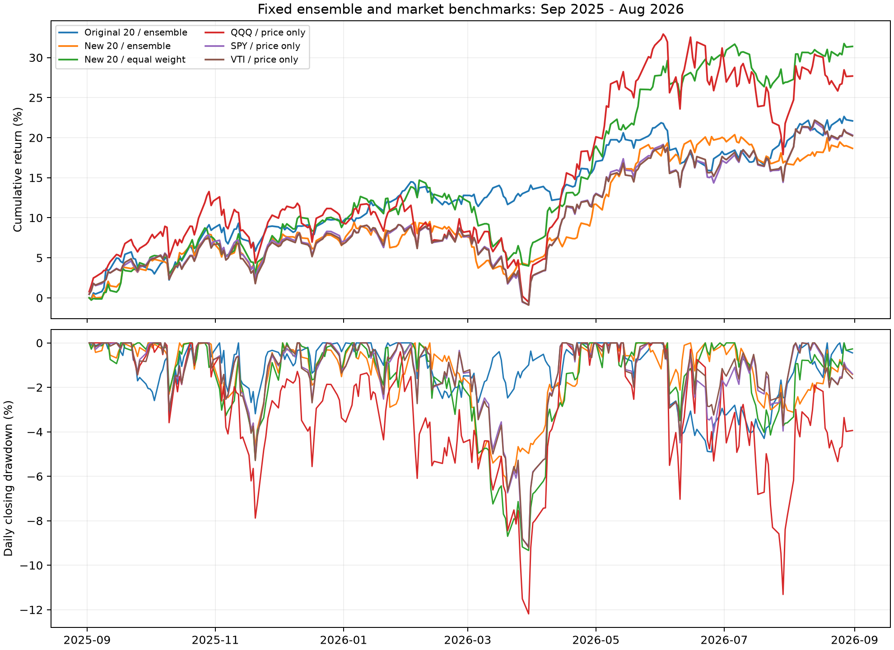

# 固定三策略组合：策略建模、执行机制与实验评估报告

> 后续发现旧引擎单股止损状态问题。本报告保留当时结果，修复后的适用结论请参见 [状态修复与重验](2026-09-21-stop-state-recheck.md)，不要直接将旧数值视作新版绩效。

**报告日期：2026-09-21**  
**对应发布策略：长线-历史预热-v1**  
**页面版本：965d6d296def**  
**发布记录 ID：8a7f59c37ad84543bf608951db59a6f9**  
**核心实现：fixed_ensemble**  
**执行引擎标识：daily-position-v3-daily-rules-v1-budget-v2**

## 1. 研究结论

该版本是一套基于日线、允许隔夜持仓的多股票共享资金策略。它把**横截面动量、通道趋势、残差反转**三个专家分别形成的目标仓位按固定的三分之一比例组合，再依据股票间协方差估计组合风险，仅向下缩减仓位。收盘形成信号，下一交易日开盘分批执行，包含佣金、价差、滑点、流动性约束、单股止损和组合回撤熔断。

它没有训练神经网络，不使用前述多尺度模式分类器，也不学习三个专家的组合系数。页面中的“模型介入”在此表示启用统计规则形成仓位，并不意味着神经网络参与。多个专家可能同时对同一股票给出非零权重，也可能相互抵消到较低目标仓位；系统不会为每支股票强制指定唯一策略。

现有证据显示，该方法在2025年9月至2026年8月的两组不重叠股票池上均取得正收益，交易成本翻倍后仍盈利；但原股票池在前一年亏损并触发熔断，新股票池又没有跑赢同期等权或大盘价格回报。因此，本报告将它定位为**具有一定跨股票迁移表现、仍需验证超额收益和跨时期稳定性的研究策略**，不将单年正收益解释为已经建立稳定盈利能力。

| 实验 | 区间净收益 | 最大日终回撤 | 平均股票仓位 | 组合熔断 |
|---|---:|---:|---:|---|
| 原20股，2025-09—2026-09 | +22.09% | 4.90% | 62.12% | 否 |
| 新20股，2025-09—2026-09 | +18.66% | 6.62% | 63.16% | 否 |
| 原20股，2024-09—2025-09 | -1.37% | 11.00% | 32.68% | 是 |

这些区间均以结束日期不含当日为准。收益包含期末持仓按收盘价估值的浮盈浮亏，已扣模拟交易成本，不含股息与现金利息。

## 2. 版本边界与实验归属

截图版本的完整冻结配置另存于[发布配置快照](2026-09-21-fixed-ensemble-deployment.json)。该发布版本支持的原股票池为：

> AAPL、AMD、AMZN、AVGO、BRK.B、COST、GOOGL、JNJ、JPM、LLY、MA、META、MSFT、NVDA、ORCL、SOFI、TSLA、V、WMT、XOM。

第二股票池为：

> ADBE、CRM、CSCO、IBM、INTC、QCOM、TXN、BAC、GS、MS、UNH、MRK、ABBV、PG、KO、PEP、HD、CAT、GE、CVX。

第二股票池在下载测试行情前固定，按知名度和行业覆盖人工选择，与原名单无交集。它是使用同一策略及有效执行配置进行的离线迁移测试，**没有扩大页面发布版本的股票范围**。

原20股+22.09%的离线配置与发布配置在部分已关闭的额外轮换字段上不同，例如轮换股票名单和每日换手上限。但在 `allocation.enabled=false`、`portfolio_policy=legacy` 下，这些字段不进入实际执行路径；不能将它们解释为本次结果使用的额外换仓约束。报告以实际生效的计算路径为准。

## 3. 数据组织与时间因果关系

### 3.1 行情与账户

输入为供应商日线OHLCV，即开盘、最高、最低、收盘及成交量。模型信号主要使用收盘价，成交使用后续交易日开盘价，持仓在日终按收盘价估值。所有股票共享一个美元现金账户，不分配独立的每股本金，不允许融资或卖空。

设股票数为 $N$，股票 $i$ 在交易日 $t$ 的收盘价为 $P_{i,t}$，对数价格为 $\ell_{i,t}=\log P_{i,t}$，对数收益为：

$$r_{i,t}=\ell_{i,t}-\ell_{i,t-1}.$$

交易日是实际美股交易日，不是自然日。模型中的63日、55日、20日、5日均按交易日序列计数。

### 3.2 预热与正式评价

2025-09—2026-09测试使用正式区间之前127个交易日预热，从2025-02-28开始。正式评价包含2025-09-02至2026-08-31的251个交易日。预热用于构建波动率、协方差、动量及通道状态，不在预热期建仓，也不将预热期损益计入报告。

63个日收益需要64个收盘价。通道状态具有路径记忆，因此只有满足最短窗口不一定能复现相同状态；改变预热起点可能改变初始信号。这也是复现实验需要固定整个数据快照，而不能只固定回测起止日期的原因。

### 3.3 信号和成交的时序

1. 正式评价开始时账户持有现金，没有从预热期继承股票。
2. 每日开盘处理此前目标仓位及风控退出；第一天没有前一正式评价日的目标，因此不会在首日开盘自动满仓。
3. 当日收盘更新净值、风险状态和各股统计信号。
4. 从正式评价首日起，每隔5个交易日更新一次目标股数。
5. 下一交易日起，按每日分批和流动性上限逐步接近目标，直到目标改变或风险退出。

这里的“5日调仓”是**每5日重算执行目标**，不是只能每5日成交一次；未完成的目标可能连续数日成交。策略也没有强制持有5日或数周的固定期限，实际持有时间由信号、成交约束和止损共同决定。

## 4. 三个策略专家的数学建模

### 4.1 统一风险估计与权重转换

每天用截至当日的最近63个日对数收益，采用Ledoit–Wolf收缩协方差估计得到 $\hat\Sigma_t$。收缩估计将样本协方差向较稳定的目标矩阵收缩，以减轻短窗口、多股票相关性估计噪声。实现还添加极小对角项以稳定数值。

定义每只股票的风险尺度：

$$\sigma_{i,t}=\sqrt{\hat\Sigma_{ii,t}}.$$

对某个专家给出的非负分数 $s_{i,t}$，先构建逆波动加权分数：

$$u_{i,t}=\frac{\max(s_{i,t},0)}{\max(\sigma_{i,t},10^{-6})}.$$

然后转换为目标权重：

$$w_{i,t}^{(k)}=\min\left(0.20,\;0.95\frac{u_{i,t}}{\sum_j u_{j,t}}\right).$$

若所有分数为零，该专家全部留现金。若单股上限截断了权重，**截断后的剩余预算不会重新分配给其他股票**。因此，95%是专家总目标的上限，不是必须达到的投入比例；活跃股票很少时，会自然保留更多现金。这是逆波动配置，不是严格的等风险贡献优化。

### 4.2 专家一：横截面动量

动量分数定义为：

$$M_{i,t}=\ell_{i,t-5}-\ell_{i,t-63}.$$

它衡量63日前至5日前的价格变化，跳过最近5个交易日，避免把最短期反转与中期强势完全混在一起。注意实际跨度是58个日收益，并非直接取最近63日涨幅。

在整个候选池中按 $M_{i,t}$ 从高到低排序，选择前 $\lceil0.25N\rceil$ 只，再要求分数大于零。20股池最多入选5只。分数并列时按股票代码确定稳定顺序。入选股票设 $s_{i,t}=1$，其他设为零，然后应用统一逆波动转换。

**经济假设：**中期相对强势可能持续，逆波动权重减少高波动个股的资金占用。  
**典型失效：**趋势骤然反转、市场风格轮动或短期强劲反弹；跳过最近5日也会导致新趋势反应滞后。  
**性质：**股票池相对排名策略，增加或移除一只股票可能改变其他股票是否入选。

### 4.3 专家二：通道趋势

每股维护一个二元激活状态 $A_{i,t}$。此前55日和20日的最高/最低**收盘价**分别为：

$$H^{55}_{i,t}=\max(P_{i,t-55},\ldots,P_{i,t-1}),\quad
L^{20}_{i,t}=\min(P_{i,t-20},\ldots,P_{i,t-1}).$$

状态更新为：

$$A_{i,t}=\left(A_{i,t-1}\lor[P_{i,t}>H^{55}_{i,t}]\right)
\land[P_{i,t}\ge L^{20}_{i,t}].$$

突破此前55日最高收盘价后激活；在跌破此前20日最低收盘价之前保持激活。这里不使用日内最高价/最低价形成通道，当前收盘也不进入“此前”窗口。激活股票设 $s_{i,t}=1$，再作逆波动配置。

**经济假设：**价格突破可能反映持续信息到达和趋势延续，较短的退出通道帮助在趋势失效后减仓。  
**典型失效：**震荡区间中多次假突破，或跳空下跌使实际退出晚于理想价格。  
**性质：**有路径记忆，和横截面排名不同；两者仍可能同时重仓同一批趋势股，不能视为独立风险源。

### 4.4 专家三：残差反转

先用股票池内的等权平均对数收益近似共同市场因子：

$$m_\tau=\frac1N\sum_{j=1}^{N}r_{j,\tau}.$$

对每只股票，在最近63个已知日收益上拟合带截距的普通最小二乘模型：

$$r_{i,\tau}=\alpha_i+\beta_i m_\tau+\epsilon_{i,\tau}.$$

用同一窗口的残差计算最近5日累计异常表现：

$$z_{i,t}=\frac{\sum_{\tau=t-4}^{t}\epsilon_{i,\tau}}
{\operatorname{std}(\epsilon_i;\mathrm{ddof}=2)\sqrt5}.$$

分数取：

$$s_{i,t}=\begin{cases}-z_{i,t},&z_{i,t}<-1,\\0,&\text{其他。}\end{cases}$$

也就是说，相对于股票池共同走势，最近5日偏弱程度超过一个估计标准差时，获得反转买入权重，偏弱越明显分数越大；随后仍受逆波动配置和单股上限限制。

**经济假设：**短期特异性卖压可能暂时偏离均衡，随后恢复。  
**典型失效：**残差下跌来自永久性基本面恶化、持续坏消息或新的下行趋势，此时买入反而会“接下跌”。  
**统计边界：**$\sqrt5$标准化隐含简化的时间尺度关系，没有专门校正残差自相关；阈值不是严格显著性检验。市场因子来自当前股票池，包含被解释股票自身，并非外部SPY因子；只有共同单因子，未剔除行业和其他风格影响。该策略只做多，不是多空市场中性套利。

## 5. 专家组合与共享资金风险预算

三个专家各自先形成权重，再作算术平均：

$$\bar{\mathbf w}_t=\frac13\left(\mathbf w_t^{\mathrm{momentum}}+
\mathbf w_t^{\mathrm{channel}}+\mathbf w_t^{\mathrm{reversal}}\right).$$

这是**权重平均**，不是先把三个原始分数相加后统一归一。若某专家无信号，其三分之一份额不会自动让渡给另外两个专家。固定配比避免增加择时自由度，但也可能把资金分配给当时无效的专家。

随后估计年化组合波动：

$$\hat\sigma_{p,t}=\sqrt{252\,\bar{\mathbf w}_t^\top\hat\Sigma_t\bar{\mathbf w}_t},\quad
\lambda_t=\min\left(1,\frac{0.10}{\max(\hat\sigma_{p,t},10^{-12})}\right),\quad
\mathbf w_t^*=\lambda_t\bar{\mathbf w}_t.$$

该风险控制只会降低股票目标，不为达到10%目标而加杠杆。10%是滚动估计下的缩放标准，不保证实际年化波动永远低于10%。新股票池实测年化波动约10.38%，并不与该设计矛盾。

目标层面股票权重合计不超过95%、单股不超过20%。剩余是现金，现金未计利息。实际持仓由于价格变化、执行延迟和整数股限制，可以偏离目标上限，因此它们不是每个时刻都强制满足的持仓硬边界。

共享资金执行先卖后买，卖出收入可供其他股票买入。该发布版本没有启用额外组合优化，也没有成本感知的按比例资金分配。当现金不足时，基础执行按确定性的股票代码顺序处理买单，后处理股票可能获得更少资金；这属于当前实现边界，不能宣称完全解决了现金紧张时的公平分配问题。

## 6. 实际执行、成本和风险退出

### 6.1 目标股数与分批

每个调仓日收盘，以组合净值 $E_t$ 和收盘价计算整数目标：

$$n^*_{i,t}=\left\lfloor\frac{E_t w^*_{i,t}}{P_{i,t}}\right\rfloor.$$

下一开盘的下单量不超过目标与实际股数之差、按开盘净值计算的单股10%资金调整额度，以及流动性上限。目标股数在下一调仓日之前保持，不随每次开盘价格重新计算为同一目标权重。

日线流动性上限使用**前一交易日总成交量除以该日常规交易分钟数，再乘1%**；正常完整交易日分母390，半日市使用实际时长。这是保守的平均分钟量代理，不是“允许成交整日成交量的1%”，也不代表开盘真实可成交数量或盘口。

### 6.2 成交价格和费用

| 项目 | 正常成本配置 |
|---|---:|
| 初始资金 | $100,000 |
| 总价差 | 2 bps |
| 单边滑点 | 2 bps |
| 每股佣金 | $0.005 |
| 每笔最低佣金 | $1 |
| 卖出附加费 | 0.3 bps |
| 成交参与率 | 前日平均分钟量的1% |

买入价为开盘价加“半价差+滑点”，卖出价减去相同项。因此正常设置的单边价格冲击为 $1+2=3$ bps，不含佣金及卖出附加费。佣金取每笔最低费用与按股费用中的较大者。双倍成本实验将上述费用项翻倍后重新执行，不是简单从最终收益减去原费用，所以成交路径可能不同。

### 6.3 止损与组合熔断

单股止损以含买入费用的持仓平均成本为基准，价格下跌达到10%时触发。检查发生在日开盘和日收盘；收盘触发后最早在下一交易日开盘卖出，不模拟日内最低价触发及成交。因此10%不是保证的最大单股损失。

组合用初始本金及历次日终净值维护高水位，开盘和收盘检查相对高水位的10%回撤阈值。一旦熔断，本次模拟不自动恢复开仓；退出可以越过日常10%分批限额，但仍受流动性限制，所以未必立即全部清仓。报告最大回撤按日终净值计算，不是日内最坏回撤。

### 6.4 配置字段的生效范围：对前序说明的更正

| 字段 | 本版本保存值 | 是否实际影响本策略 |
|---|---|---|
| `model` | `fixed_ensemble` | 是，选择三专家公式 |
| `rebalance_days` | 5 | 是，目标更新节奏 |
| `tranche_weight` | 0.10 | 是，常规单股每日调整上限 |
| `max_weight` | 0.20 | 是，目标权重上限 |
| `stop_loss_pct` / `max_drawdown_pct` | 10 / 10 | 是，单股与组合风险退出 |
| `portfolio_policy` | `legacy` | 是，基础共享账户执行 |
| `allocation.enabled` | false | 是，关闭额外轮换优化 |
| `entry_band` | 0.005 | **否**，基础执行且额外轮换关闭时不检查该门槛 |
| `lookback` / `horizon` / `confidence` | 20 / 5 / 0.5 | 不改变本策略固化公式 |
| `capital_mode` / `daily_vol_target` | signal_budget / 0.015 | 被本策略目标权重公式覆盖 |
| 额外轮换中的最大持股数、换手预算等 | 配置中保留 | 因额外轮换关闭且非成本感知执行，不生效 |
| 成本对象中的分钟策略参数 | 兼容字段 | 不表示本日线策略使用这些分钟交易规则 |

此前回复把0.5%首次建仓门槛列为运行配置，字段确实存在，但没有说明其在此执行分支中不生效。这里明确修正。尤其不能依据配置中的“最大持股数3”认定本策略最多持有3股。

## 7. 实验设计与数据一致性

### 7.1 保持固定的内容

已完成对照保持三专家公式、三分之一配比、风险缩放、有效执行参数与正常费用一致。第二股票池在下载行情前固定；测试没有因表现不好而替换股票，也没有按结果改变窗口或阈值。正常/双倍费用和等权对照均保存完整结果。

这并不意味着所有研究历史都无选择偏差：同一2025—2026年份已在先前研究中多次查看，原股票池也是当前选择的名单。更准确的描述是“固定方法的历史对照与跨标的迁移测试”，不是严格未见的时间样本外检验。

### 7.2 拆股、预热和前一年失败

在线日线接口原先获取raw价格，2024-09开始的实验自动附带240个自然日预热，因而遇到2024年WMT、NVDA、AVGO拆股的价格断层。直接忽略这些跳变会扭曲信号；直接把交易期raw和不同尺度的历史拼接也不正确。

前一年测试使用供应商split历史修正**预热部分**，各股以2024-08-30同日raw/split收盘比例统一历史OHLC尺度，成交量作反向调整。正式评价期仍使用原始报价，锚点早于评价期。2025—2026原股票池使用类似的截止前锚点方法；新股票池7560条日线覆盖完整，未触发价格跳变阈值，不需要补正。

这种处理不等于引擎已经支持持仓期间所有公司行动。通用拆股持仓、现金分红及完整总回报仍未实现；当前获取的复权因子也不是历史时点原封不动的供应商快照。

## 8. 实验结果

### 8.1 正常成本及成本压力测试

| 股票池 / 策略 | 费用倍数 | 净收益 | 最大回撤 | 平均股票仓位 | 成交笔数 |
|---|---:|---:|---:|---:|---:|
| 原20股 / 固定三策略 | 1 | +22.09% | 4.90% | 62.12% | 592 |
| 原20股 / 固定三策略 | 2 | +20.44% | 4.99% | 62.06% | 594 |
| 新20股 / 固定三策略 | 1 | +18.66% | 6.62% | 63.16% | 623 |
| 新20股 / 固定三策略 | 2 | +16.84% | 6.78% | 63.03% | 620 |
| 原20股 / 等权含风控 | 1 | +1.54% | 10.41% | 52.06% | 321 |
| 新20股 / 等权含风控 | 1 | +31.39% | 9.34% | 96.06% | 663 |
| 新20股 / 等权含风控 | 2 | +30.13% | 9.46% | 96.03% | 654 |

原股票池的等权策略触发组合熔断，不能将+1.54%解释成该池全年无风控买入持有收益。新池等权未熔断，股票暴露明显高于三策略。双倍费用后仍盈利说明这两个具体案例不是完全依赖极低摩擦，但不能证明任意成交环境下都能维持收益。

原池期末权益为$122,092.74，估算全部平仓后的收益约+22.05%；新池期末$118,663.29，估算平仓后约+18.62%。新池手续费$656.43、价差与滑点影响$690.19，均已计入净收益，不应再重复扣除。

### 8.2 前一年：必须保留的反例

原股票池2024-09-01至2025-09-01（不含）共249个交易日，净收益**-1.37%**、最大回撤**11.00%**，期末$98,630.15，成交402笔。首次组合熔断日期为**2025-04-04**，随后保持现金。

阈值为10%而实现回撤接近11%，来自离散检查、跳空及执行约束，并不应修改为“最大回撤被严格限制在10%”。这个结果显示，后一年正收益不能外推到其他市场路径；永久熔断保护后续风险的同时，也可能失去后续反弹机会。

### 8.3 新股票池的收益集中与月度路径

新池正常成本的主要净利润贡献为CAT $6,638.36、CSCO $3,591.71、MRK $3,432.44、INTC $3,171.56，合计约占净利润的**90.2%**。这是相对最终净利润的比例，亏损股票会使该集中度指标偏高，不能误读为四股占总正利润90.2%。主要负贡献为GE -$1,698.66、CRM -$1,154.39、BAC -$928.46。

| 月份 | 新20股三策略净收益 |
|---|---:|
| 2025-09 | +4.15% |
| 2025-10 | +2.66% |
| 2025-11 | +0.51% |
| 2025-12 | -0.87% |
| 2026-01 | +1.27% |
| 2026-02 | -0.08% |
| 2026-03 | -3.00% |
| 2026-04 | +6.79% |
| 2026-05 | +6.12% |
| 2026-06 | +1.30% |
| 2026-07 | -2.76% |
| 2026-08 | +1.66% |

月收益按月末账户权益相对前月月末计算，首月相对初始本金；全期收益需连乘，不能把月百分比直接相加。当前逐股贡献不能说明三个专家分别赚了多少：它们合并目标后使用同一账户及风控，缺少单专家消融与独立归因，因此不在报告中编造专家收益拆分。

### 8.4 与大盘比较

以同期ETF首交易日开盘买入、末交易日收盘估值，比较251个相同交易日：

| 策略或ETF | 区间收益 | 最大日终回撤 | 日收益年化波动 |
|---|---:|---:|---:|
| 原20股固定三策略 | +22.09% | 4.90% | 本次未单列 |
| 新20股固定三策略 | +18.66% | 6.62% | 10.38% |
| SPY / 标普500 | +20.32% | 9.13% | 12.77% |
| VTI / 美国全市场 | +20.23% | 9.20% | 13.03% |
| QQQ / 纳斯达克100 | +27.69% | 12.19% | 19.57% |

图中两股票池三策略与新池等权均为扣模拟交易成本的账户曲线；ETF为价格曲线，不含投资者交易成本、现金分红再投资。各曲线按相同初始本金归一。QQQ是成长/科技权重较高的纳斯达克100，不是美国全市场。

新池策略比SPY少约1.66个百分点收益，同时最大回撤少约2.51个百分点。它持有更多现金，不能把较低回撤完全归因于预测或择时。对SPY日收益的描述性beta约0.535，也反映了较低市场暴露；单年回归没有给出经多重研究调整的统计显著性，不足以据此宣称稳定alpha。

原池比SPY价格回报高约1.77个百分点，但换股后该差额转负。同池等权+31.39%也超过新池三策略。综合看，当前结果支持一定程度的风险降低，尚未证明风险暴露匹配后存在稳健超额收益。

## 9. 能够与不能够得出的结论

**现有实验支持：**

- 规则、账户和执行能够形成可复现的日线多股票组合，支持共享资金、分批、先卖后买和隔夜持仓。
- 在固定的2025—2026年度，对两组不重叠股票池均获得扣费正收益，费用压力测试仍为正。
- 在这些具体对照中，组合暴露、波动与回撤低于高投入的等权或大盘持有方式。

**现有实验尚不支持：**

- 稳定跑赢大盘、持续获得alpha，或在任意一年维持正收益。
- 三专家配比最优，或者每个专家对收益均有独立正贡献。
- 10%风险阈值构成实盘最大损失保证，或日线模拟成交能在真实盘口完全复现。
- 识别了每只股票真实市场模式，或已使用模式网络动态选择最优策略。

名单是事后选择的活跃股票，没有退市和历史成分变化；多个策略此前在同一年上研究过，存在选择和重复检验问题。股息、现金利息和税费缺失，ETF与策略手续费口径也不同。股票之间高度相关，20股×251日不等于5020个独立样本。预热通道状态和止损熔断路径都可能对结果产生非线性影响。

## 10. 后续验证建议

下一阶段应先冻结新的实验协议，再取未用于设计的时间区间或开展前向纸面跟踪。优先工作为：

1. 使用历史时点股票池及多个不重叠时期，做带预热和时间隔离的滚动验证，完整保留失败与熔断案例。
2. 在相同风险和资金暴露下，与ETF加现金、简单等权组合比较，并补齐股息与现金收益，避免把低仓位误认为择时优势。
3. 做三专家的独立与移除消融，测量持仓重叠和损益相关性，检验固定三分之一组合是否真正提供互补。
4. 修正基础执行现金不足时的顺序分配问题，并单独比较成本感知执行；新执行结果应作为新版本报告，不能覆盖历史结果。
5. 为持仓期间拆股、现金分红、交易暂停和极端缺口建立明确会计与执行规则，随后再讨论部署到真实账户。

这些是待做验证，不是本报告已经完成的结果。报告编写没有追加收益驱动调参，也没有修改当前页面发布策略。

## 11. 复现、来源与审计

核心代码：

- [日线策略公式](../../backend/src/quant_workbench/daily_strategies.py)：`rule_forecasts`、逆波动配置、三专家权重与波动率缩放。
- [日线执行引擎](../../backend/src/quant_workbench/position.py)：`simulate_positions`、共享现金、开盘分批、费用与熔断。
- [固定对照脚本](../../scripts/evaluate_pattern_policy.py)：包含原股票池三策略及其他基线。
- [新股票池复现脚本](../../scripts/evaluate_alternate_universe.py)：固定名单、季度分段下载和四组离线对照。

实验记录：

- [原股票池完整对照JSON](2026-09-18-pattern-policy-v2.json)与[研究报告](2026-09-18-pattern-policy-v2.md)。本报告只引用其中`fixed_ensemble`及相关基线，不将模式网络结果归属于该发布策略。
- [前一年报告](2026-09-18-fixed-ensemble-2024.md)及[配置、锚点与指标](2026-09-18-fixed-ensemble-2024.json)。
- [第二股票池测试协议](2026-09-18-alternate-universe-protocol.md)、[报告](2026-09-18-alternate-universe.md)及[完整指标与曲线](2026-09-18-alternate-universe.json)。
- [大盘比较报告](2026-09-18-alternate-universe-market.md)及[ETF曲线与统计](2026-09-18-alternate-universe-market.json)。

新池行情SHA256：`9bf08fda65d75ae641b31a3956aae70f65574f995424fe1a861aa1449aa8b83f`。ETF行情SHA256：`39c736a9db67d8533220892f8c5d6986f6f8ffb1c2ea1d945467c0d01f1ac3f2`。原始行情及完整逐笔结果保存在本机artifacts目录，不在报告中包含API凭证。此前相关模式/因果性/账本及API测试共41项通过；新池实验另核验交易日完整性、股票池不重叠、净贡献与总权益一致等。本次为文档与既有结果复核，没有重新训练或改变策略。

页面版本号用于标识冻结发布参数，不能单独代替完整代码、行情摘要和执行环境的版本锁定。复现实验应同时保存这些资料，而不是仅记录页面名称。
