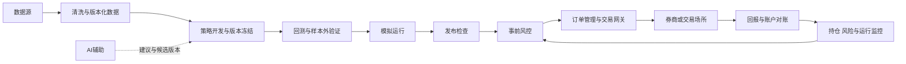

# 量化平台需求分析与个性化确认清单

> 2026年9月17日更新：本文保留首次参考分析。用户随后明确采用本地原生部署、前后端分离、研究与使用展示两个面板、美股短线研究方向。当前范围以同目录《本地美股策略平台范围与课件分析.md》为准；本文中的容器、机构平台和强运行隔离不再作为默认需求。

分析日期：2026年9月17日

参考来源：同目录《金融量化交易平台产品需求文档.docx》，文档版本 V1.0，编制日期 2026年9月10日。下文按原文章节定位。原文标题中的“开发立项版”仅代表参考文件自身状态，不代表本项目已立项或已确认这些要求。

当前目录只有这份参考需求文档和系统隐藏文件，尚无代码、现有架构或团队说明。本分析用于确定你的实际产品范围；所有技术、分期和团队安排均为建议，待你的回答后收敛。

## 1 对参考文档的判断

参考文档描述的是同时服务个人与机构的综合量化平台。它包含数据、研究、回测、模拟、实盘、策略共享、机构权限、AI、全球市场与高频系统。其核心是可复现的策略研究和可追踪、可对账的交易闭环，而不仅是行情与收益展示页面。

文档已经提供较完整的业务能力目录、订单异常处理原则、策略版本体系和安全边界，但尚不足以直接估算本项目工期或确定实现架构。缺少的关键信息包括实际使用者、优先市场、已获授权的数据和交易接口、业务规模、开发资源、预算、首版目标，以及对参考功能的取舍。

原文阶段一建议 6—9 个月，阶段二 4—6 个月，阶段三 6—12 个月。这些是参考计划，不能视为对本项目的报价、排期或交付承诺。需要先拆出可验证的小范围版本。

### 1.1 原文已经表达清楚的原则

| 原则 | 来源 | 对实际设计的意义 |
| --- | --- | --- |
| 不包含收费、支付、结算和收益分成 | 1.3、10.3 | 默认不建设商业结算系统，是否改变仍由你确认 |
| 回测绑定策略、数据、依赖和引擎版本 | 4.3、5.3、14 | 版本和实验追踪应从基础设计开始 |
| 订单未知状态不得盲目重发 | 7.2、17.2 | 实盘必须具备订单查询、幂等、对账和恢复能力 |
| 研究计算不得影响实盘 | 13.2 | 即使使用同一代码仓库，也需要独立的运行资源和故障边界 |
| AI不直接修改运行中的策略代码 | 9.2 | 代码生成、参数建议与实盘执行应有不同权限 |
| 高频和标准交易共享语义但分开运行 | 8 | 统一接口不等于同一套引擎能满足所有延迟要求 |

这些是参考文档的要求，不应全部自动变为你的首版范围。若实际接入实盘，订单一致性、基础风控、凭证保护与对账则应随实盘一起交付。

### 1.2 需要修正或补充的地方

| 待澄清点 | 原文依据 | 建议处理 |
| --- | --- | --- |
| 策略目录首期归属不一致 | 10.3写“首期策略目录”；18及附录A将策略共享放入后续平台化范围 | 区分首期私有策略库与后续公开策略社区 |
| Tick基准与高频分期边界不清 | 20要求首批Tick级做市或执行策略；18把高频放在第三阶段 | Tick数据研究、Tick回测、低延迟实盘分别确认；三者不是同一个交付物 |
| 机构基础权限与高级机构功能未拆清 | 阶段一含用户组织，阶段二含机构权限 | 确认单用户、团队权限、多租户隔离、审批各自属于哪一版 |
| “标准证券市场”缺少明确对象 | 4.1、20 | 必须落实到市场、资产、数据供应商和交易通道 |
| 可用性与恢复目标存在验收张力 | 16要求月度99.95%，同时RTO不高于30分钟 | 若按30天全天统计，99.95%约允许21.6分钟停机；30分钟恢复上限可能耗尽该月预算，应明确统计窗口、故障范围和更严格的实际恢复目标 |
| 性能没有负载与测量边界 | 16提出P99 100ms/50ms | 补充硬件、行情订阅量、订单速率、并发策略量，以及是否包含外部网络与券商耗时 |
| “管理员不能读取策略”缺少威胁模型 | 2、12、19 | 普通后台权限隔离与抵御宿主机最高权限读取不是同一承诺；后者需要额外架构与运维约束 |
| “禁止未来函数”不能仅靠代码扫描实现 | 6.2、10.2 | 需要当时可获得的数据、财报实际披露时间、历史成分股与退市标的、修订版本及因果测试 |
| AI“置信度”没有定义 | 9.1—9.3 | 明确可评测的质量指标，不把大模型自报数值当作可靠概率 |
| 验收条件没有完全对应分期 | 19同时包含策略公开发布、AI和机构隔离 | 每期独立验收，避免后期功能成为首版的隐含交付义务 |

## 2 最终成品的部件构成

用户最终使用的是一套工作台，但其后需要多个独立承担职责的部件。下表是完整产品的分解；“核心”以研究回测版为起点，“条件必需”表示启用对应业务时必须一起建设。

| 部件 | 用户看到或获得什么 | 后台承担什么 | 范围建议 |
| --- | --- | --- | --- |
| 工作台与交互界面 | 项目、任务、报告、运行状态和告警 | 身份会话、查询聚合、任务进度推送 | 核心；首版可合并多个“中心” |
| 数据服务 | 数据目录、标的查询、数据质量与导入 | 供应商接入、统一标的和日历、清洗、快照、版本及许可记录 | 核心；先接一个市场和一个可靠来源 |
| 策略工作区 | 策略列表、代码或参数编辑、版本记录 | Python策略SDK、依赖环境、代码和配置版本、任务隔离 | 核心；Notebook、Web IDE、本地IDE不必全部自建 |
| 回测与实验引擎 | 回测配置、净值、风险、交易明细和对比 | 事件处理、撮合、成本及市场规则、指标、可复现实验 | 核心；先支持目标策略必需的回测类型 |
| 模拟运行系统 | 实时信号、模拟订单、持仓、偏差分析 | 接收真实行情并模拟执行，维护订单与账户状态 | 需要实时观察时纳入；与历史回测明确区分 |
| 实盘交易系统 | 账户、订单、成交、持仓与运行控制 | OMS订单生命周期、网关、账户同步、幂等、对账、断线恢复 | 接实盘时必需；高级拆单执行另行分期 |
| 风控与审计 | 限额、告警、暂停、撤单和事件记录 | 事前校验、运行中风险判断、故障时阻断新增风险、审计 | 研究版保留基本日志；模拟和实盘逐级强化 |
| AI辅助系统 | 代码解释、策略草稿、报告解读或参数建议 | 模型接入、上下文权限、运行预算、输出评估及记录 | 按主要痛点选择一项，避免首版建设完整AI治理平台 |
| 协作与策略资产系统 | 私有库、共享、评审、授权或公开目录 | 用户组织、权限、源码与运行权限分离、审核 | 私有版本库优先；组织或公开分发按需建设 |
| 开放接口与适配器 | Python SDK、API、数据与券商接入能力 | 统一接口契约、错误码、插件能力声明及兼容性验证 | 内部契约从第一天明确；公开门户可后置 |
| 运维与交付系统 | 可安装的版本、运行说明、故障处理入口 | 配置、监控、备份恢复、发布回滚、密钥管理 | 随部署规模分级建设 |
| 高频专用系统 | 低延迟策略运行与专用性能报告 | C++/Rust运行时、本地风控、专用行情与交易链路 | 仅有明确需求、通道和预算时单独立项 |

除了软件页面，完整交付还应包括：数据库迁移与配置模板、一个可运行的示例策略、约定范围的数据样本或接入脚本、回测复现说明、安装和操作文档、验收记录。若包含实盘，还需要网关适配、订单恢复和对账证据、风控配置、故障处置手册。真实数据、交易权限及第三方许可证不能通过写代码替代。

### 2.1 主要依赖关系



AI、公开策略社区和高频不应成为基础研究闭环的前置依赖。实盘接入一旦纳入范围，对账和故障恢复就不能留到最后补做。

## 3 产品路线选择

| 路线 | 适合情况 | 第一版边界 | 主要取舍 |
| --- | --- | --- | --- |
| A 个人研究工作台 | 自用、学习、策略验证或尚未确定交易通道 | 单市场、数据接入、策略版本、回测报告，可选AI解释 | 最容易验证价值；未包含生产实盘保障 |
| B 个人或小团队交易系统 | 已有策略、账户和接口，希望持续模拟或运行实盘 | 在A之上加入模拟、交易网关、订单状态、对账与基础风控 | 运行责任和测试成本明显增加 |
| C 面向机构或公众的平台 | 明确需要多人协作、授权分发或对外服务 | 在B之上加入租户隔离、组织权限、审批、配额和运营 | 最接近参考文档，建设和持续运维成本最高 |

在尚不了解你的资源和目标时，建议以A作为讨论起点，保留通往B的接口边界。如果你最迫切的问题就是已有策略的实盘运维，应直接围绕B设计最小闭环。如果面向外部客户是确定目标，则不能用单用户安全模型代替C所需的租户隔离。

推荐按验收结果推进：确定样例策略和市场规则 → 数据和回测可复现 → 模拟运行可观察 → 实盘订单可恢复且可对账 → 根据真实使用扩展AI、协作或其他市场。具体时间需要结合团队和通道验证后估算。

## 4 所需分工与协作接口

以下是职责划分，不代表必须招聘对应数量的人。一人可以承担多个角色；涉及真实资金时，仍应明确发布、风险限额和异常处置的责任归属。

| 工作流 | 主要负责 | 交付物 | 关键协作关系 |
| --- | --- | --- | --- |
| 产品与量化业务 | 使用场景、策略定义、市场规则、优先级、验收 | 个性化需求、样例策略、验收样例、风险规则 | 你决定目标和取舍，量化或交易专家核验业务口径 |
| 界面与应用服务 | 工作台、项目任务、报告、权限和通知 | 前端、业务API、交互规范 | 与引擎团队先约定任务状态、报告格式和错误信息 |
| 数据工程 | 数据接入、标的日历、质量、历史版本 | 数据适配器、标准字段、数据快照 | 为回测与交易提供一致的标的和时间语义 |
| 量化引擎 | 策略SDK、回测、撮合、费用、实验和指标 | 策略运行契约、基准策略、复现报告 | 与交易研发对齐订单意图、成交和账户语义 |
| 交易与风控 | 模拟、OMS、网关、账户、限额和对账 | 订单状态机、交易适配器、风控与恢复流程 | 依赖真实接口能力；账户事实最终与外部通道核对 |
| AI应用 | 模型接口、代码或报告助手、评测 | 可追溯的建议、评测样例和预算限制 | 依赖数据和策略接口；不承担订单执行责任 |
| 质量、安全与运维 | 测试环境、回归、故障演练、密钥与发布 | 测试证据、部署包、监控、恢复手册 | 从数据契约和订单异常场景阶段开始参与 |

个人研究版可合并为产品/业务、全栈、数据/量化三个职责组，由开发兼顾基础测试和部署。实盘版应有明确的交易与风控负责人、验证负责人和故障响应人；这些是责任要求，实际人员数待资源确认。高频工程仅在路线确定后新增。

如果你的预期是“你负责决策，AI辅助完成开发”，也需要保留你对业务规则、账户权限、预算和实盘上线的确认职责。AI辅助编码不能替代交易接口开通、业务验收和持续值守。

最先统一的协作契约应包括：标的与交易日历、行情时间戳、策略输入及订单意图、订单与成交状态、账户资金口径、风控事件、策略和数据版本、报告指标公式。各模块在这些边界明确后才适合并行实现。

## 5 建议的项目结构

对于个人或小团队，优先考虑单仓库、业务模块清楚的应用服务，加独立计算进程与交易进程。代码集中管理有利于追踪版本，进程和权限隔离用于控制资源及故障影响。暂不根据参考文档的模块数量直接建立十几个微服务。

以下是逻辑结构草案，不是已创建的工程；可以按实际范围删减目录。

```text
quant-platform/
├── apps/
│   ├── web/                 # 工作台、数据、策略、报告、运行控制
│   ├── api/                 # 项目、任务、用户权限等业务入口
│   ├── compute-worker/      # 回测、优化和数据计算任务
│   └── trading-runtime/     # 模拟或实盘运行；按范围启用
├── packages/
│   ├── domain/              # 标的、账户、订单、成交等公共语义
│   ├── contracts/           # API、事件和插件接口定义
│   ├── strategy-sdk/        # 策略生命周期与上下文
│   ├── backtest/            # 事件驱动、撮合、成本和市场规则
│   ├── analytics/           # 收益风险指标、归因与报告
│   ├── data/                # 数据标准化、查询、快照和质量
│   ├── trading/             # 订单状态、账户同步和对账
│   ├── risk/                # 风险规则与执行控制
│   └── ai/                  # 可选AI服务及评测
├── adapters/
│   ├── market-data/         # 外部行情和历史数据源
│   ├── brokers/             # 券商、经纪商或交易所
│   └── models/              # AI模型供应商或本地模型
├── strategies/examples/     # 可复现的示例和基准策略
├── configs/                 # 非敏感配置模板和市场规则
├── migrations/              # 数据库结构版本
├── tests/
│   ├── unit/                # 指标、费用、状态转换等
│   ├── contract/            # 数据、策略、网关接口兼容
│   ├── integration/         # 数据到回测、订单到账户
│   ├── replay/              # 历史事件复现与回归
│   └── failure/             # 断线、重复回报、乱序、恢复
├── infra/                   # 部署、监控、备份和运行脚本
└── docs/                    # 需求、架构、接口、验收与操作手册
```

原始行情、大型回测产物、交易凭证和生产账户记录不进入源码仓库。使用外部数据目录、数据库或对象存储；仓库只保存样例、Schema和配置模板。

技术候选可以是 Web 前端与 Python 研究计算，关系数据库保存业务状态，Parquet等文件格式保存研究数据。是否采用其他业务语言、队列、时序库、缓存、容器集群及多可用区，应由规模、部署和团队经验决定。行情历史存储与订单交易账本有不同要求，不应因“统一数据”而混成一个存储模型。

## 6 个性化确认清单

请优先回答Q01—Q10；不确定的项目可以写“待定”。Q11—Q20用于细化验收与体验，可以随后补充。候选项只是帮助表达，均可自由修改。

| 编号 | 请你确认或回答 | 可参考的回答方向 | 影响 |
| --- | --- | --- | --- |
| Q01 | 你做这个项目最想解决什么问题？描述一个最常用的实际场景。 | 学习量化、减少研究重复劳动、验证已有策略、托管已有实盘策略、对外提供产品 | 产品主线 |
| Q02 | 第一版由谁使用？未来是否对外开放？ | 仅自己、小团队、机构内部、公众用户；预计人数 | 权限、协作和租户隔离 |
| Q03 | 第一个市场和具体资产是什么？ | A股股票/ETF、期货、港股、美股、其他；先选一个主要范围 | 数据、交易规则和适配器 |
| Q04 | 主要策略及频率是什么？有没有已有策略可作为样例？ | 日频选股、ETF轮动、分钟择时、套利、Tick研究、低延迟交易 | 引擎、数据粒度和性能需求 |
| Q05 | 第一版做到哪个交易阶段？ | 仅研究回测、回测加模拟、人工确认后下单、规则约束下自动实盘 | 交易与运维工作量 |
| Q06 | 已有何种数据源、券商账户或接口权限？ | 写供应商、券商或接口名称及是否开通；没有也可明确写没有 | 可行性与外部依赖；不需要提供密码或密钥 |
| Q07 | 谁参与开发和维护？你希望亲自承担什么？ | 个人加AI、现有团队、外包；熟悉语言、已有可复用代码 | 技术栈、分工和交付形式 |
| Q08 | 希望何时用上第一版？首版最重要的三个结果是什么？ | 给目标日期，并按重要性排序 | 范围和里程碑 |
| Q09 | 建设投入与每月运行预算分别是多少？ | 可提供区间；说明是否包含数据订阅、模型API、服务器和人力 | 自建与复用、数据和部署选择 |
| Q10 | 运行在哪里，有哪些隐私或网络限制？ | 本机、Windows交易机、家庭服务器、云；代码和账户信息能否进入第三方服务 | 接口兼容、部署和AI调用方式 |
| Q11 | 你会用什么具体任务判断第一版成功？ | 用指定策略跑完某段历史、对齐已有报告、完成模拟流程等 | 可执行验收，避免以收益保证代替功能验收 |
| Q12 | 希望如何创建策略，已有多少编程基础？ | Python、本地IDE/Notebook、参数模板、可视化、自然语言 | 研究工作区复杂度 |
| Q13 | AI最需要帮你做什么，可以行使多大权限？ | 解释代码、生成草稿、解读回测、优化参数、提供交易建议；指定模型或本地部署 | AI范围、数据访问和执行边界 |
| Q14 | 最常用的终端和界面风格是什么？ | 浏览器、桌面工具、手机只读；简洁研究工具或密集交易终端；中文或双语 | 页面结构和视觉设计 |
| Q15 | 是否需要共享策略或保护源码？ | 完全私有、团队共享、指定人可运行但不能读源码、公开发布；是否涉及收费 | 权限、沙箱、审核和商业边界 |
| Q16 | 预计数据与运行规模多大？ | 标的数量、历史年限、数据粒度、同时回测数、运行策略数、账户数；未知可先给使用场景 | 存储、并发、保留周期和容量规划 |
| Q17 | 最在意哪些回测真实性问题？ | 复权、分红、停牌、涨跌停、T+1、手续费、滑点、财报披露时间、样本外验证；是否有对照系统 | 市场规则实现与结果解释 |
| Q18 | 如接实盘，怎样定义限额、人工控制及异常责任？ | 单笔金额、敞口、回撤、允许标的；谁能启停、撤单、调限额，断线后怎样处置 | 风控规则和操作流程 |
| Q19 | 需要怎样的持续运行保障？ | 手动启动的本地研究、交易时段在线、全天在线；告警接收人、备份恢复期望 | 可用性目标与持续维护投入 |
| Q20 | 参考文档里最想保留、明确不要、希望新增的功能各是什么？ | 尤其确认高频、全球市场、机构中心、公开社区、移动端、AI自动编排和收费是否需要 | 个性化删减，防止参考范围默认继承 |

### 6.1 可直接复制的首轮答复模板

```text
Q01 项目目的与典型场景：
Q02 使用者与人数：
Q03 首个市场与资产：
Q04 策略类型与频率：
Q05 第一版交易阶段：
Q06 已有数据源及交易接口：
Q07 开发维护人员与技术基础：
Q08 目标日期与三个优先结果：
Q09 建设预算与每月预算：
Q10 部署位置与隐私限制：
其余问题的补充或明确不要的功能：
```

## 7 确认后的收敛方式

收到回答后，将形成属于你的产品范围表：明确首版必须有、后续再做、明确不做的能力；为每项首版功能指定使用场景、输入输出、负责人及验收标准；再确定技术方案、实际目录和依赖顺序。当前分析不构成实盘上线授权，也未建立代码工程或修改原始参考文档。
